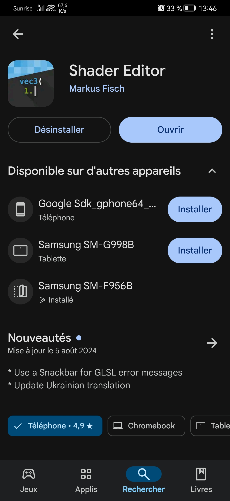
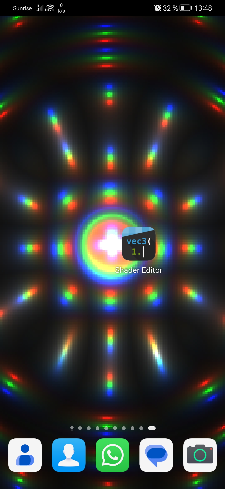
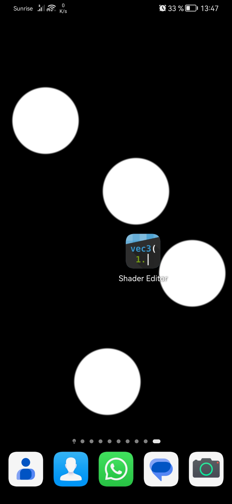
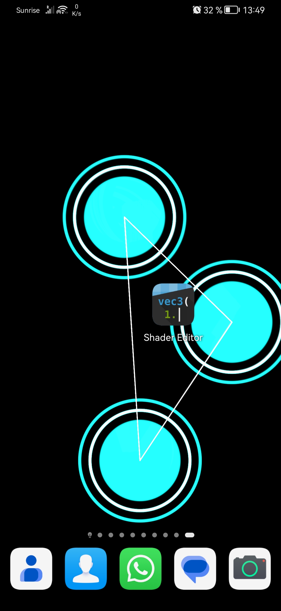
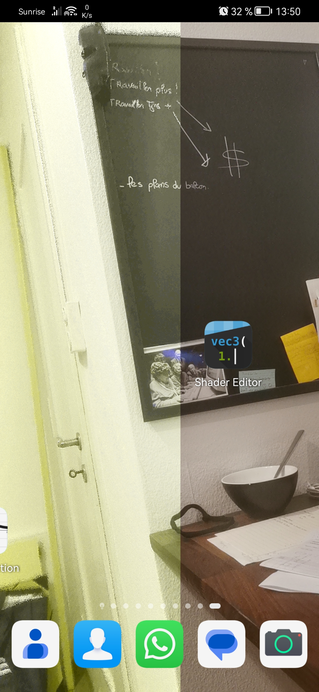
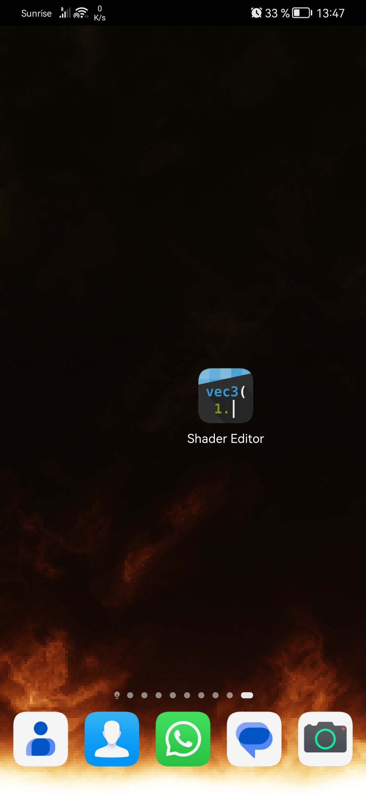
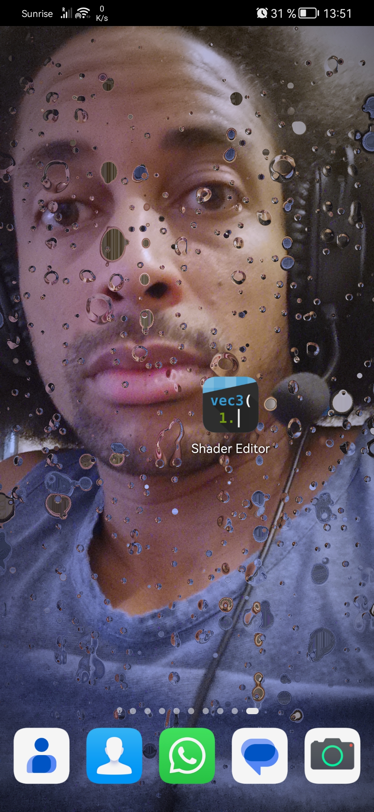

# ANDROID SHADERS AS BACKGROUND

## Bienvenue! 👋

Vous pouvez télécharger cet excellent programme de Markus Fisch sur le PlayStore en cherchant "Shader Editor"

Vous trouverez ici quelque shaders que vous pouvez copiez sur votre téléphone dans l'éditeur.

## CineShader

Le crédit de ce shader va normalement à une personne sur Shadertoy mais je ne le retrouve plus pour le noter ici.
Dès que je le retrouve je le crédite.

## circleTouch

Un simple cercle lorsque l'on touche l'écran.

## circleTouch2

L'amélioration du cercle de base avec des cercles sans remplissage et des lignes reliant les cercles.

## dogVision

Mon amie voulait voir comment voyais son chien, j'ai vu qu'il y avait des applications qui faisait payer cela, voici le shader qui tente de le faire aussi bien.

## Fire

Le feu... et le voir en mouvement c'est incroyable par contre il faudra probablement baisser la resolution de ce shader qui demande beaucoup...
Crédit pour mu6k de Shadertoy
[lien vers l'original](https://www.shadertoy.com/view/4ttGWM)

## Heart

Incroyable shader de gouttes finissant par former un coeur.
Adaptation du shader Heartfelt de BigWIngs
J'ai remplacé la texture par la camera frontale mais j'aurai surement dû flouter l'image pour obtenir un rendu plus proche de l'originale

[lien vers l'original](https://www.shadertoy.com/view/ltffzl)

**Amusez vous !** 🚀

*************************************************************************************************************************

# ANDROID SHADERS AS BACKGROUND
## Welcome! 👋
You can download this excellent program by Markus Fisch from the PlayStore by searching for “Shader Editor”.

Here you'll find some shaders you can copy to your phone in the editor.

## CineShader

Credit for this shader normally goes to someone on Shadertoy but I can't find it to note here.
As soon as I find it I'll credit it.

## circleTouch

A simple circle when you touch the screen.

## circleTouch2

Enhancement of the basic circle with unfilled circles and lines connecting the circles.

## dogVision

My friend wanted to see how her dog saw, I saw that there were applications that charged for this, here's the shader that tries to do it 
as well.

## Fire

Fire... and seeing it in motion is incredible. However, you'll probably have to lower the resolution of this shader, which is very demanding...
Credit for mu6k by Shadertoy
[link to original](https://www.shadertoy.com/view/4ttGWM)

## Heart

Incredible drop shader ending up as a heart.
Adapted from BigWIngs' Heartfelt shader.
I've replaced the texture with the front camera, but I probably should have blurred the image to get something closer to the original.
[link to original](https://www.shadertoy.com/view/ltffzl)

**Enjoy! 🚀

