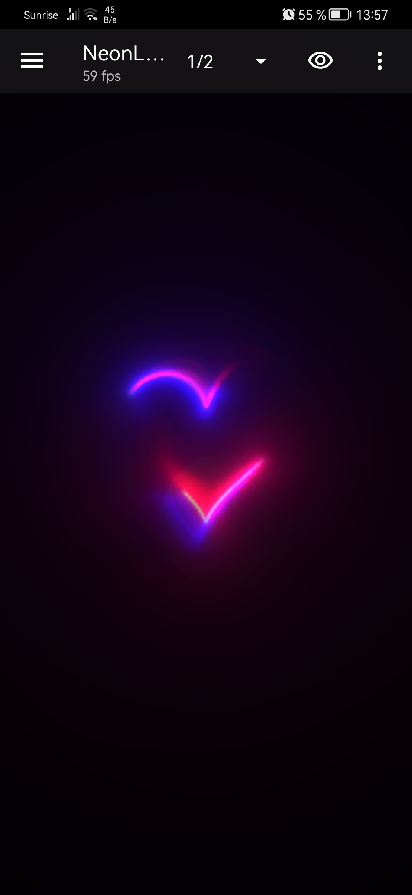
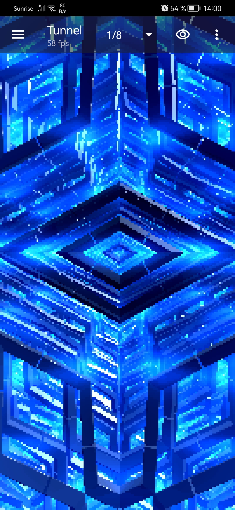
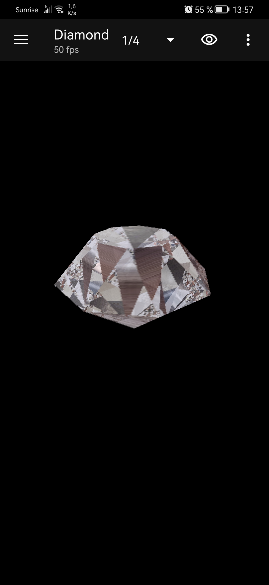
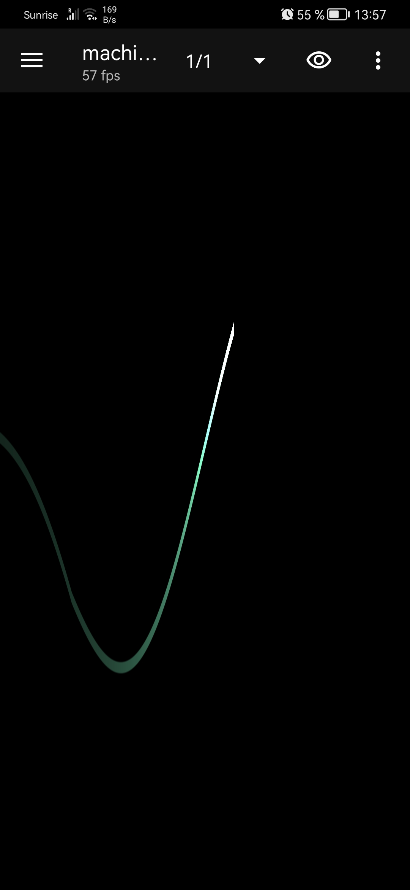
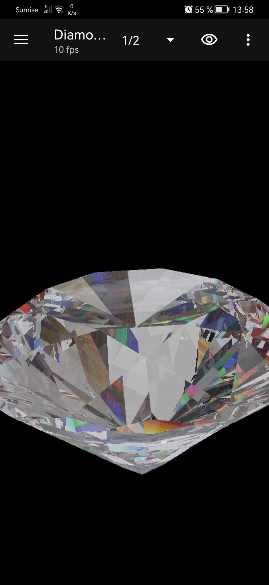
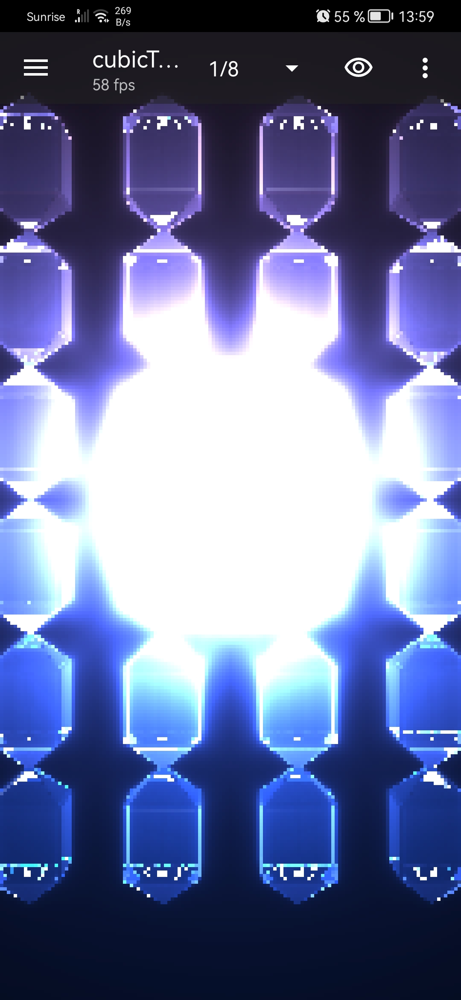
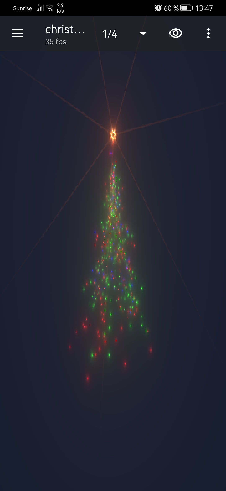
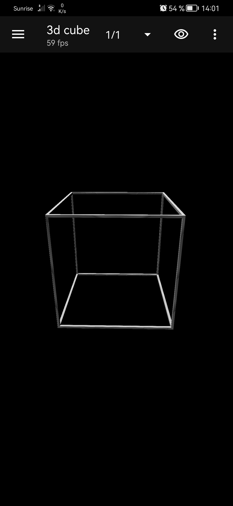

# ANDROID SHADERS AS BACKGROUND

## Bienvenue! 👋 

<a href="https://www.youtube.com/shorts/rdYq62ceGvI"> Youtube Demo Video </a>

Vous pouvez télécharger cet excellent programme de Markus Fisch sur le PlayStore en cherchant "Shader Editor"

Vous trouverez ici quelque shaders que vous pouvez copiez sur votre téléphone dans l'éditeur.
Selon votre telephone, vous devrez baisser la résolution du rendu.

## NeonLove
 
-Devient plus ou moins gros selon votre niveau de batterie 
-Si vous le chargez il s'illuminera 
-Réagit à vos doigts 

## Tunnel
 

## Diamond1
 
Un diamant controllable avec les doigts, les reflections proviennent de la camera frontale 

## ElectroCardio
 

## Diamond2
 
Un diamant, les reflections proviennent de la camera frontale 

## CubicTransform
 
Somes cubes 

## ChristmasTree
 
C'est noël, réagit à votre doigt 

## 3DCube
 
Un cube 3d qui se tourne avec l'inclinaison ou la rotation de votre telephone 

## CineShader
 
Le crédit de ce shader va normalement à une personne sur Shadertoy mais je ne le retrouve plus pour le noter ici.
Dès que je le retrouve je le crédite. 

## circleTouch
 
Un simple cercle lorsque l'on touche l'écran. 

## circleTouch2
 
L'amélioration du cercle de base avec des cercles sans remplissage et des lignes reliant les cercles. 

## dogVision
 
Mon amie voulait voir comment voyais son chien, j'ai vu qu'il y avait des applications qui faisait payer cela, voici le shader qui tente de le faire aussi bien. 

## Fire
 
Le feu... et le voir en mouvement c'est incroyable par contre il faudra probablement baisser la resolution de ce shader qui demande beaucoup...
Crédit pour mu6k de Shadertoy
[lien vers l'original](https://www.shadertoy.com/view/4ttGWM) 

## Heart
 
Incroyable shader de gouttes finissant par former un coeur.
Adaptation du shader Heartfelt de BigWIngs
J'ai remplacé la texture par la camera frontale mais j'aurai surement dû flouter l'image pour obtenir un rendu plus proche de l'originale

[lien vers l'original](https://www.shadertoy.com/view/ltffzl) 

**Amusez-vous !** 🚀
